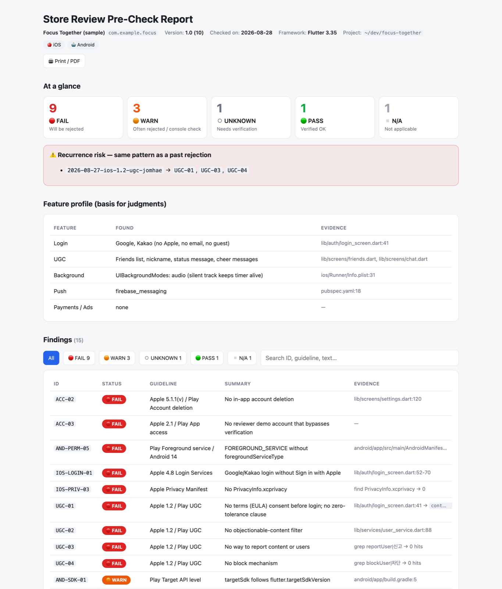

<p align="center">
  
</p>

<h1 align="center">store-review-check</h1>

<p align="center"><b>앱스토어·플레이스토어 리젝을 <i>제출 전에</i> 잡는다.</b><br>
Claude Code, Codex CLI, 그리고 SKILL.md를 읽는 모든 에이전트용 <a href="https://agentskills.io">Agent Skill</a>.</p>

<p align="center">
  <a href="README.md">English</a> ·
  <a href="README.ko.md">한국어</a> ·
  <a href="README.ja.md">日本語</a> ·
  <a href="README.zh-CN.md">简体中文</a>
</p>

<p align="center">
  
  
  
  
</p>

---

## 왜 만들었나

"친구와 함께하는 집중 타이머" 앱으로 실제로 받은 리젝입니다:

> **Guideline 1.2 – Safety – User-Generated Content**
> 앱에 사용자 생성 콘텐츠가 있는데 필요한 안전장치가 모두 갖춰져 있지 않습니다… *약관(EULA) 동의 필수… 부적절 콘텐츠 필터… 신고 기능… 사용자 차단 기능…* 데이터가 채워진 데모 계정(Google 또는 Kakao)을 제공하세요… 실기기 화면 녹화를 첨부해 답신하세요…

닉네임이 보이는 친구 목록 하나로 "UGC 앱"이 됐습니다. 저 요구사항은 전부 **제출 전에 코드만 보고** 알 수 있는 것들입니다. 이 스킬이 그 일을 합니다 — 그래도 리젝이 오면 케이스로 저장해 다음 점검 때 다시 씁니다.

공식 원문을 뒤져서야 안 것: 2026년 6월 개정판부터 Apple은 **"simple timers"**를 포화 카테고리(4.3(b))로 명시합니다 — 타이머 앱은 "의미 있게 다른 경험"을 스토어 설명과 심사 노트에 써야 합니다. 체크리스트가 이것도 잡습니다.

## 하는 일

| 모드 | 이렇게 말하면 | 이걸 받습니다 |
|---|---|---|
| **사전 점검** | `심사 체크해줘` / `/store-review-check ~/dev/app` | 스캔 → 기능 프로필 → 체크리스트 전 항목 🔴 FAIL / 🟠 WARN / ⚪ UNKNOWN / 🟢 PASS 판정 + `파일:라인` 근거 + 수정 방법 + 증빙 → **HTML 리포트(브라우저) 또는 채팅** → 콘솔 체크리스트 → 심사 노트 초안 |
| **리젝 처리** | 리젝 메일 붙여넣기 | 파싱 → 케이스 저장 → 체크리스트 매핑 → **동반 리젝 예측**(예: 구글/카카오 로그인만 → Sign in with Apple 4.8) → 수정 계획 → 증빙 녹화 순서 → 영어 답신 → 심사 노트 |
| **심사 제출 정보** | `심사 노트 써줘` | App Store Connect *App Review Information* 노트와 Play Console *앱 액세스* 문구: 데모 계정, 인증 우회, 신고·차단·약관 위치 |

스킬이 물어보는 건 전부 **선택지**입니다(필요하면 다중 선택): 플랫폼, 범위, HTML/채팅, 다음 작업. 주관식 질문으로 왔다 갔다 하지 않습니다.

## 설치

**Claude Code**
```bash
git clone https://github.com/LeeHueeng/store-review-check.git ~/.claude/skills/store-review-check
```
**Codex CLI**
```bash
git clone https://github.com/LeeHueeng/store-review-check.git ~/.codex/skills/store-review-check
```
**그 외 Agent Skills 런타임** — 해당 런타임의 skills 폴더에 클론 (폴더명은 `store-review-check` 유지).

에이전트 재시작 후:

```
> 심사 체크해줘                      # 현재 디렉토리 사전 점검
> /store-review-check ~/dev/app     # Claude Code, 경로 지정
> $store-review-check                # Codex CLI
> 리젝 왔어: <메일 붙여넣기>          # 리젝 처리
> 심사 노트 써줘                      # 제출 정보
```

스캐너만 따로:
```bash
bash ~/.claude/skills/store-review-check/scripts/scan.sh ~/dev/app
```
Flutter, React Native, Expo, iOS·Android 네이티브를 인식합니다. 출력은 "신호"이고, 판정 전에 에이전트가 파일을 직접 엽니다.

## 예시

```
## 심사 사전 점검 — Focus Together (iOS, Android) 2026-08-28
🔴 FAIL 9 · 🟠 WARN 3 · ⚪ UNKNOWN 1 · 🟢 PASS 1   (재발 위험: 2026-08-27-ios-1.2-ugc)

### 🔴 지금 고쳐야 제출 가능
1. UGC-01 로그인 전 약관 동의 없음 — Apple 1.2 / Play UGC (lib/auth/login_screen.dart:41)
2. UGC-03 신고 기능 없음 — Apple 1.2 / Play UGC
3. UGC-04 차단 기능 없음 — Apple 1.2 / Play UGC
4. IOS-LOGIN-01 구글/카카오 로그인만 있고 Sign in with Apple 없음 — Apple 4.8
5. ACC-02 앱 내 계정 삭제 없음 — Apple 5.1.1(v) / Play
6. ACC-03 2단계 인증 없이 로그인되는 심사용 계정 없음 — Apple 2.1 / Play 앱 액세스
7. AND-PERM-05 FOREGROUND_SERVICE에 foregroundServiceType 없음 — Android 14
8. IOS-PRIV-03 PrivacyInfo.xcprivacy 없음 — ITMS-91053
…
리포트: store-review/report-2026-08-28.html
```

## 무엇을 검사하나

| 영역 | 예 | 근거 |
|---|---|---|
| **UGC·모더레이션** | 무관용 조항이 있는 약관 동의, 콘텐츠 필터, 신고, 차단(즉시 제거 + 개발자 알림), 24시간 조치, 실기기 녹화, 데이터 채운 데모 계정 | Apple 1.2 · Play UGC |
| **계정·로그인** | 로그인 벽, 앱 내 계정 삭제(+Play 웹 링크), 해외 IP에서 되는 데모 계정, 소셜 로그인 시 Sign in with Apple, 카카오/구글 콘솔 설정 | Apple 5.1.1(iv)(v), 4.8, 2.1 · Play 계정 삭제, 앱 액세스 |
| **개인정보** | 앱 내+스토어 개인정보처리방침, App Privacy/Data safety 라벨 vs SDK, ATT/AD_ID, 사전 고지, Privacy Manifest | Apple 5.1.1, 5.1.2 · Play 사용자 데이터 |
| **권한** | 사용 API별 목적 문구, 거부해도 동작, 안 쓰는 권한, Android 제한 권한·선언 양식(사진/동영상, FGS 타입, 정확한 알람, 접근성, QUERY_ALL_PACKAGES…) | Apple 5.1.1(ii) · Play 권한 |
| **결제·광고** | 디지털 재화 IAP/Play 결제, 구독 고지+약관 링크, 구매 복원, IAP 첨부, 테스트 광고 ID, 방해 광고 | Apple 3.1.1, 3.1.2 · Play 결제, 광고 |
| **백그라운드·타이머** | 타이머 유지용 무음 오디오(2.5.4), FGS 타입+Play 선언, 로컬 알림 대체 | Apple 2.5.4 · Android 14 FGS |
| **완성도·메타데이터** | 플레이스홀더, iPad 크래시, 타 플랫폼 언급, 스크린샷, 연령 등급 "사용자 상호작용", 제목 규칙, 지원 URL | Apple 2.1, 2.3.x, 2.4.1, 4.0 · Play 메타데이터 |
| **플랫폼 요구치** | targetSdk 마감, 16KB 페이지, AAB/64비트, 수출 규정, 최소 Xcode, 신규 Play 계정 비공개 테스트, FamilyControls 승인 | — |
| **한국** | 만 14세 미만 법정대리인 동의, 방침 필수 기재, IARC/GRAC | 개인정보보호법 |

**118개 항목**, 각각 *근거 / 적용 조건 / 확인 / 스캐너 신호 / 수정 / 증빙 / 사례*. 전 항목을 2026-08-28 기준 공식 원문(App Store Review Guidelines 2026-06-08 개정판, Play 정책 센터)과 대조했습니다 — 원문 인용·URL·2025~2026 변경 이력은 [`references/`](references/).

## 실제 리젝 사례

[`rejections/community-cases.md`](rejections/community-cases.md)에 **실제 리젝 사례 100건 이상**(2022~2026)을 개발자 포럼·Reddit·Apple Developer Forums·Play 커뮤니티·블로그(영·한·일·중)에서 모은 실제 리젝 사례를 심사관 문구, 원인, 통과시킨 수정, 출처 링크와 함께 정리했습니다. 각 사례는 체크리스트 ID에 연결되어 사전 점검에서 *"이것 때문에 실제로 리젝된 사람이 있고, 이렇게 고쳐서 통과했다"*고 알려줍니다.

## 내 리젝을 학습시키기

1. 메일 붙여넣기 → `rejections/YYYY-MM-DD-<platform>-<guideline>-<app>.md`에 `checklist_ids`와 함께 저장.
2. 체크리스트에 없던 사유 → 항목 추가, 스캐너로 잡히면 신호 추가.
3. 다음 사전 점검 → 겹치면 최상단에 **재발 위험**으로 표시.

## 구성

```
SKILL.md                     스킬 본문 (규칙, 선택지 흐름, 모드별 워크플로, 신호→항목 매핑)
scripts/scan.sh              프로젝트 신호 스캐너 (bash 3.2 / BSD grep 호환)
scripts/render_report.py     JSON → 단일 HTML 리포트 (필터, 다크모드, 체크 상태 저장, 노트 복사)
checklists/common.md         기능 조건부 항목
checklists/ios.md            App Store 항목
checklists/android.md        Google Play 항목
checklists/ko/               번역 (영어가 정본)
references/                  체크리스트를 대조한 공식 출처
templates/                   리포트 스키마, 케이스, 심사 노트, 답신, UGC 약관 조항, 녹화 순서
rejections/                  케이스 KB — 내 케이스 + community-cases.md
docs/                        샘플 리포트 JSON + 스크린샷
```

## 호환

- **Claude Code** — `AskUserQuestion`(다중 선택)으로 묻고, HTML 리포트를 렌더링해 엽니다.
- **Codex CLI** — 같은 SKILL.md. 질문은 채팅의 번호 선택지로 나옵니다.
- [Agent Skills 규격](https://agentskills.io/specification)(`name` + `description` frontmatter)을 따르는 모든 런타임.

## 기여

PR 환영 — 특히 **실제 리젝 사례**(심사관 문구 + 고친 방법)와 **가이드라인 변경**. `rejections/community-cases.md`에 한 줄 추가하고 해당 체크리스트 항목의 `Cases:`에 링크하세요.

## 주의

가이드라인은 바뀝니다. 날짜 의존 수치(targetSdk 마감, 최소 Xcode, 비공개 테스트 인원)는 "기준일"이 붙어 있으니 제출 전 공식 페이지에서 확인하세요. 이 도구는 리젝을 줄이지, 승인을 보장하지 않습니다.

## 라이선스

MIT
